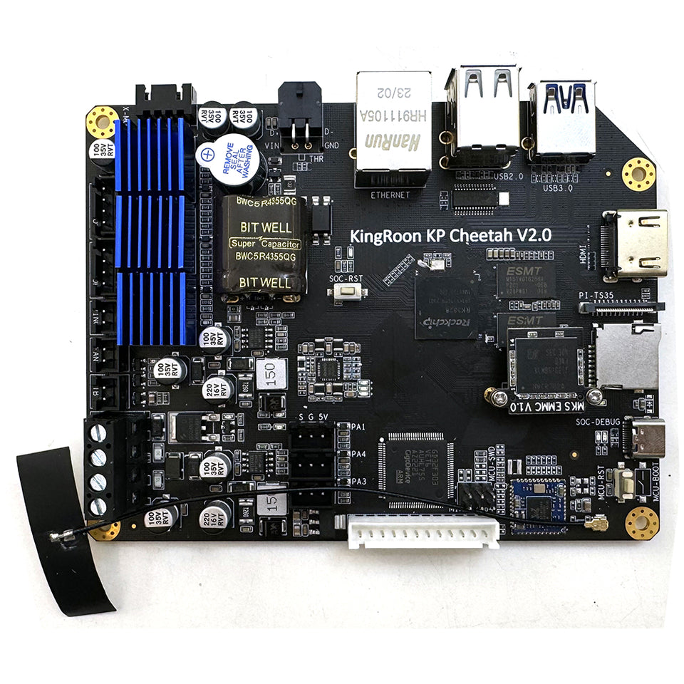
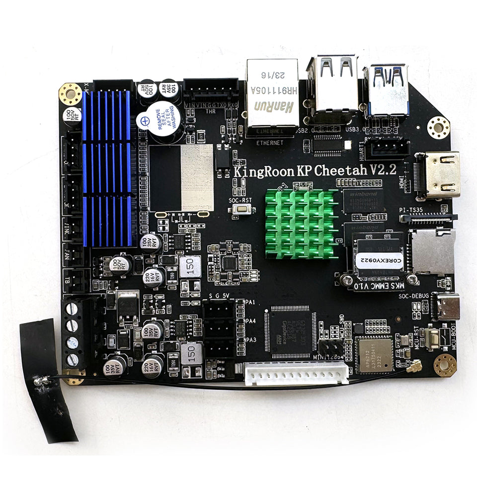
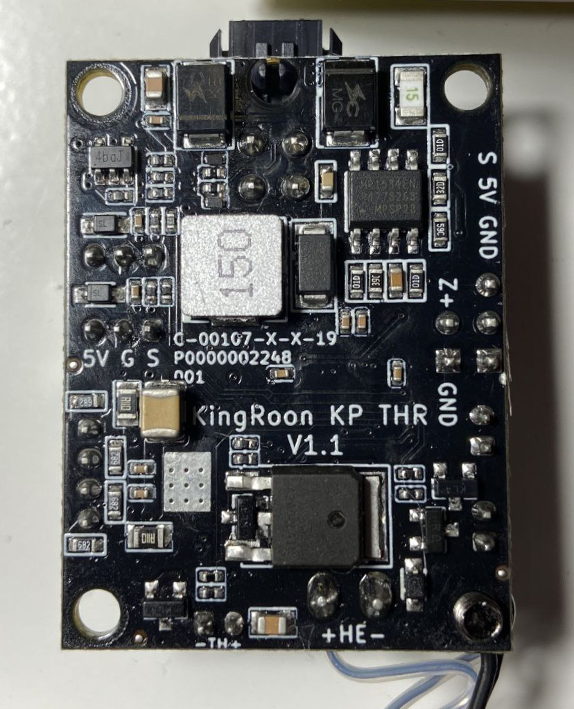
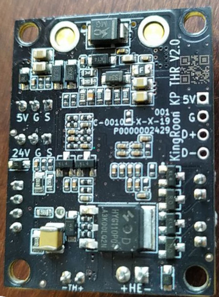
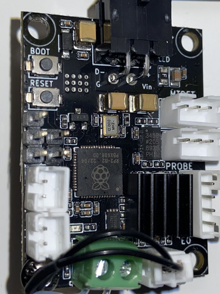
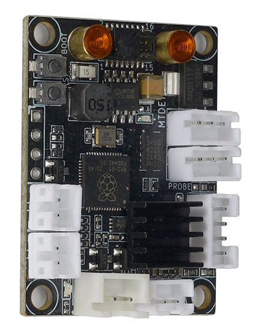

# Mainboard

## Difference between V2 hardware

<table>
  <tr>
    <th style="text-align:center">V2.0</th>
    <th style="text-align:center">V2.2</th>
  </tr>
  <tr>
    <td width="50%" valign="top">
      <ul>
        <li>THR MCU connected via USB</li>
        <li>MCU on the motherboard connected via UART</li>
        <li>Thermal barrier cooler can't be controlled by THR MCU</li>
        <li>THR plate can be flashed without disassembling</li>
        <li>It has Realtek 8723BS Wi-Fi adapter</li>
        <li>Firmware file name written to SD card for flashing mcu should be cheetah_v2.bin</li>
        <li>Has a supercapacitor that allows the operating system to shutdown correctly. System is online about 15 sec
          after switch was turned off. State can be checked by gpioget 2 16 (0 power is on/1 power is off)</li>
      </ul>
    </td>
    <td width="50%" valign="top">
      <ul>
        <li>THR MCU connected via UART</li>
        <li>MCU on the motherboard connected via USB</li>
        <li>Thermal barrier cooler can be controlled by THR MCU</li>
        <li>THR plate can be flashed after disassembling and soldering pins to USB contacts (you can see it on the
          picture below marked with 5V GND D+ D-)</li>
        <li>It has a different Wi-Fi adapter</li>
        <li>Firmware file name written to SD card for flashing mcu should be cheetah_v2_2.bin</li>
      </ul>
    </td>
  </tr>
  <tr>
    <td colspan="2" style="text-align:center">Motherboard</td>
  <tr>
    <td style="text-align:center"></td>
    <td style="text-align:center"></td>
  </tr>
  <tr>
    <td colspan="2" style="text-align:center">THR</td>
  <tr>
  <tr>
    <td style="text-align:center"></td>
    <td style="text-align:center"></td>
  </tr>
  <tr>
    <td style="text-align:center"></td>
    <td style="text-align:center"></td>
  </tr>
</table>

## Booting from USB flash

In case you do not want to disassemble the printer or you do not have an emmc adapter you can use USB flash drive.
Prepare USB flash drive:

```bash
sudo dd if=$(ls build/output/images/*.img) of=/dev/sdb bs=1M status=progress && sync
```

And copy armbian image somewhere to root partition of this flash drive to have it after booting available.

Then we need to boot printer from this USB flash drive. Uboot bootloader autoboot process can be interrupted by hiting any key. But it has no bootdelay for that by default. So you need to hiting any key too fast and sometimes it works. To do that you need to start serial communication program like picocom:

```bash
picocom --b 1500000 /dev/ttyUSB0
```

Baud rate should be 1500000 to see booting log corectly.  
Then reboot your printer and start hiting an any key as fast as you can :-) If failed reboot and try to hit faster. You can reboot your printer through ssh (ssh mks@192.168.1.15 'reboot') and hold ESC button in terminal window (easier than hiting keys).

If success you will see an uboot prompt:

```txt
Hit any key to stop autoboot:  0 
=>  
=>  
```

Change boot_targets environment variable:

```sh
setenv boot_targets "usb0" 
```
By default the first booting device is `mmc1`.

Changes for mkspi board already merged with armbian repository. In case you have an old armbian on your emmc it is necessary to specify fdtfile:

```sh
setenv fdtfile "rockchip/rk3328-mkspi.dtb"
```

And type `boot`.

In case you are using [Release](https://github.com/Fabian-Schmidt/kingroon_klp1/releases/latest) image just login into console and connect your printer to wifi access point.
