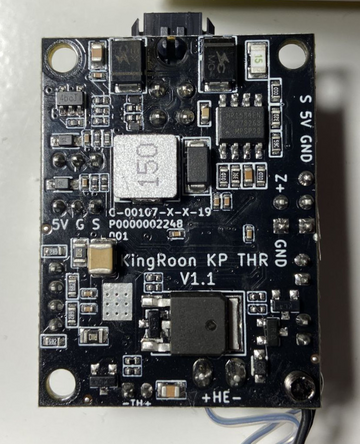
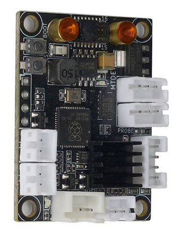

# Mainboard

<table>
  <tr>
    <th style="text-align:center">V2.0</th>
    <th style="text-align:center">V2.2</th>
  </tr>
  <tr>
    <td width="50%" valign="top">
      <ul>
        <li>THR MCU connected via USB</li>
        <li>MCU on the motherboard connected via UART</li>
        <li>Thermal barrier cooler can't be controlled by THR MCU</li>
        <li>THR plate can be flashed without disassembling</li>
        <li>It has Realtek 8723BS Wi-Fi adapter</li>
        <li>Firmware file name written to SD card for flashing mcu should be cheetah_v2.bin</li>
        <li>Has a supercapacitor that allows the operating system to shutdown correctly. System is online about 15 sec
          after switch was turned off. State can be checked by gpioget 2 16 (0 power is on/1 power is off)</li>
      </ul>
    </td>
    <td width="50%" valign="top">
      <ul>
        <li>THR MCU connected via UART</li>
        <li>MCU on the motherboard connected via USB</li>
        <li>Thermal barrier cooler can be controlled by THR MCU</li>
        <li>THR plate can be flashed after disassembling and soldering pins to USB contacts (you can see it on the
          picture below marked with 5V GND D+ D-)</li>
        <li>It has a different Wi-Fi adapter</li>
        <li>Firmware file name written to SD card for flashing mcu should be cheetah_v2_2.bin</li>
      </ul>
    </td>
  </tr>
  <tr>
    <td colspan="2" style="text-align:center">Motherboard</td>
  <tr>
    <td style="text-align:center"></td>
    <td style="text-align:center"></td>
  </tr>
  <tr>
    <td colspan="2" style="text-align:center">THR</td>
  <tr>
  <tr>
    <td style="text-align:center"></td>
    <td style="text-align:center"></td>
  </tr>
  <tr>
    <td style="text-align:center"></td>
    <td style="text-align:center"></td>
  </tr>
</table>
