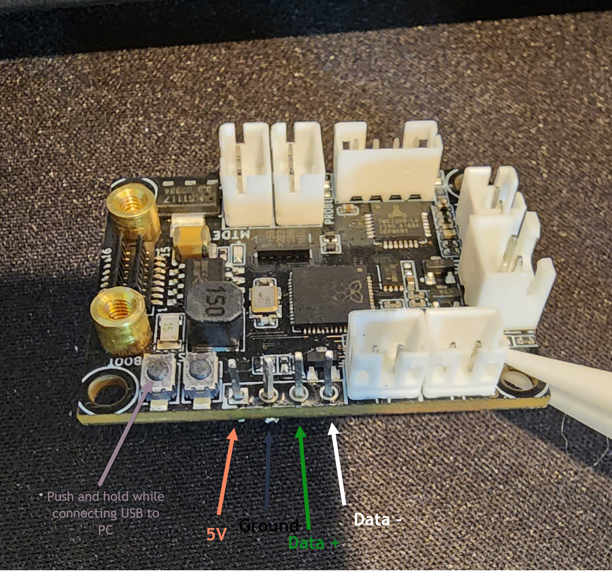
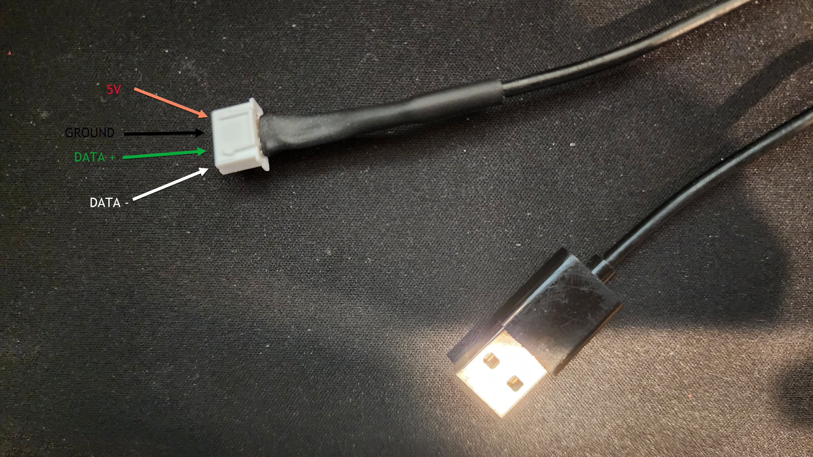
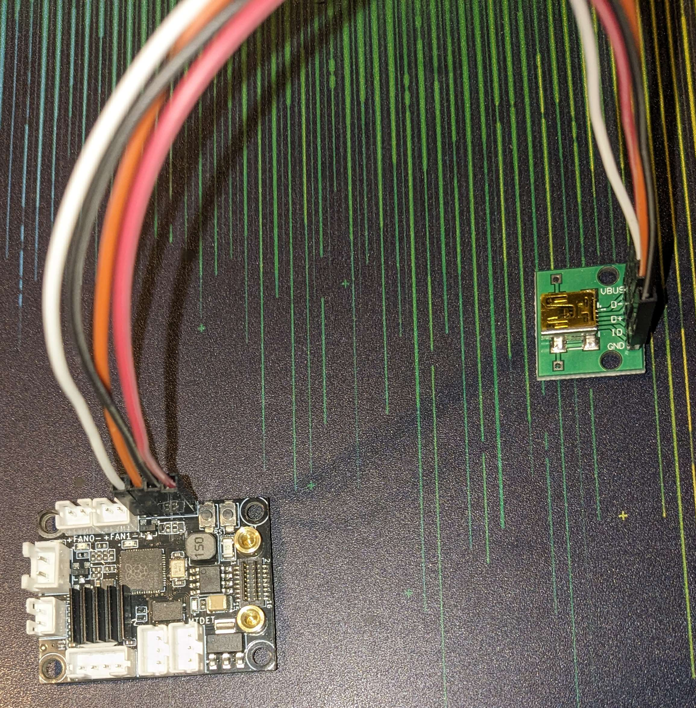

# Kingroon KLP1 210 system image building and flashing tutorial

**This repository is in no way approved by or affiliated with the official Kingroon repository.**

**I am not responsible for any problems or damages with your devices or this code and instructions**

## Requirements

- Kingroon KLP1 210 with [Cheetah V2.2 Motherboard](Mainboard.md)
- Soldering Iron
  - Means to connect Toolhead to USB cable.
- MKS EMMC Adapter V1.0 or analog (supplied included).
  - **It is possible to change system image without printer disassembling check** [here](Mainboard.md#booting-from-USB-flash)
  - microSD card reader suitable to work with EMMC (read below)

## Toolhead board (THR) flash

### Soldering USB to Toolhead board

You can disassembly an old mouse to get USB cable and JST-XH 2.5mm(2.54mm) connector or use Dupont cable and USB breakout board.

See also [Kingroon guide](https://kingroon.com/blogs/3d-print-101/flash-thr-board-firmware-of-kingroon-kp3s-pro-v2-klp1-3d-printer).

#### JST-XH

 

### Dupont & breakout board



> [!WARNING] 
> It is possible to burn out your motherboard if the printer is on during THR module disconnecting.

Before proceeding it is better to disconnect original cable from THR module.

1. While holding down the "boot" button on the rp2040, plug in the USB cable to any PC that will automount a USB drive for you to access the files (Windows, Ubuntu Desktop, MAC, etc)
2. If done and wired correctly, a drive named `RP1-RP2` will be connected.
3. Copy the [klipper.uf2](https://github.com/Fabian-Schmidt/kingroon_klp1/releases/latest) file to the `RP1-RP2` drive
4. The rp2040 will immediately reboot itself and load the new firmware as soon as the file transfer is complete. This is normal.
5. Wait 30 seconds, then unplug the rp2040 and reinstall in the printer.

<details>
<summary>

### *Optional Advanced* Toolhead board (THR) flash katapult

</summary>

As alternative to flashing Klipper directly onto the RP2040 you can flash Katapult which allows later upgrading Toolhead firmware without dissamble.

The katapult firmware image is avaiable as [katapult.withclear.uf2](https://github.com/Fabian-Schmidt/kingroon_klp1/releases/latest).

After flashing this image you must flash klipper in the device. Follow the [official 
readme](https://github.com/Arksine/katapult) for this.

Basic instructions are:

```bash
~/klipper$ make menuconfig
~/klipper$ make
~/katapult/scripts$ python3 flashtool.py -d /dev/ttyS0 -r
~/katapult/scripts$ python3 flashtool.py -d /dev/ttyS0 -f ~/klipper/out/klipper.bin
```

</details>

## Flash EMMC on Mainboard


See also [Kingroon guide](https://kingroon.com/blogs/3d-print-101/how-to-flash-the-emmc-chip-on-kingroon-kp3s-pro-v2-klp1-klipper-3d-printers).

> [!TIP] 
> You can pruchase a second (larger & faster) eMMC module to avoid creating a backup.

1. Create a backup of all your klipper configuration.
2. Shutdown printer.
3. Disconnect power from the device.
4. Remove the bottom cover of KLP1.
5. Unscrew two screws fastening the EMMC module.
6. Put the EMMC card into microSD adapter and insert it into your PC.
7. *Recommended* Create a full backup of the content of the EMMC.
   - Windows use [Win32 Disk Imager](https://sourceforge.net/projects/win32diskimager/)
   - Linux use `dd`
8. Flash [KLP1_*.img.xz](https://github.com/Fabian-Schmidt/kingroon_klp1/releases/latest) file.
   - Windows use [balenaEtcher](https://etcher.balena.io/)
   - Linux use `dd`
9. Insert EMMC back into printer and add the two screws.
10. Start printer. First startup will take a bit longer. Do not turn off printer until startup is complete.
11. Either start with supplied klipper configuration or restore klipper configuration from backup.
12. *Recommended* Perform [Printer / Klipper tuning](https://ellis3dp.com/Print-Tuning-Guide/).

# Acknowledgement

Thanks to [Lebensgefahr](https://github.com/Lebensgefahr/kingroon_kp3s_pro_v2) for his work.